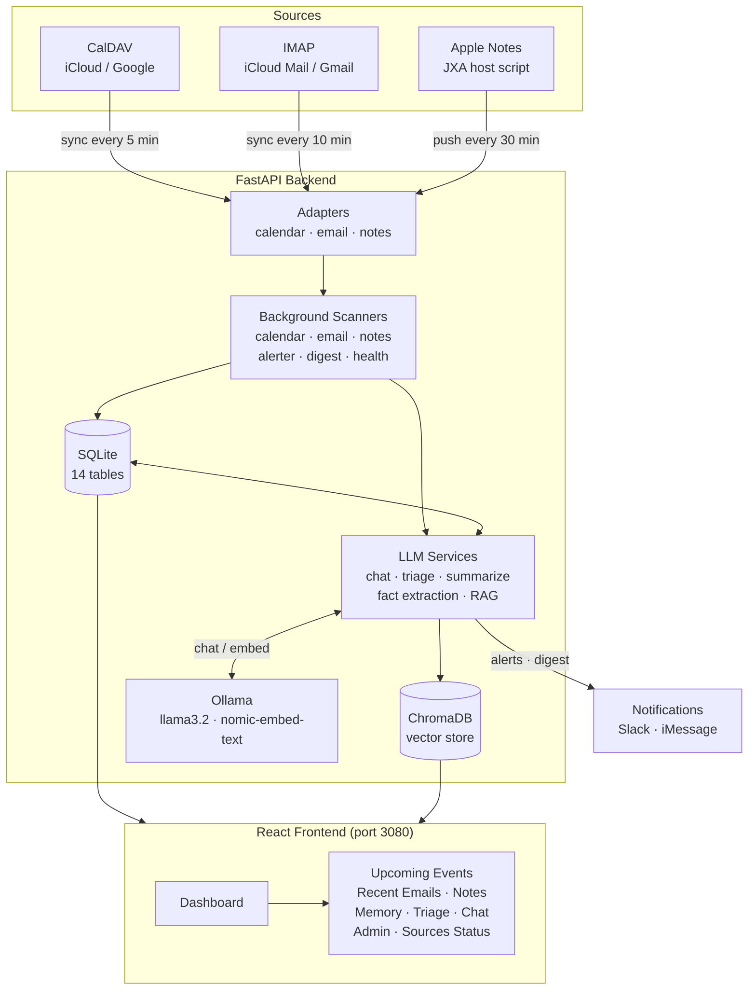
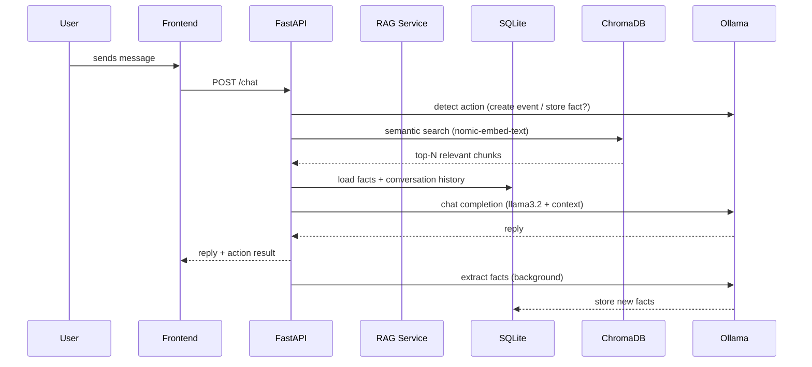

# AI Assistant

A self-hosted personal AI assistant that syncs your calendar, email, and notes, then lets you chat with them using a local LLM. Runs entirely on your own hardware — no data leaves your machine.

   

## What it does

- **Chat with your data** — Ask questions across calendar, email, and notes using RAG (semantic search + local LLM)
- **Upcoming events** — Dashboard card showing the next 7 days of calendar events
- **Email triage** — Automatically classifies emails as urgent / important / fyi / ignore with summaries
- **Notes sync** — Indexes Apple Notes for semantic search (2500+ notes supported)
- **Memory** — Extracts and remembers facts from conversations (contacts, preferences, deadlines)
- **Calendar alerts** — Notifies you when events are about to start
- **Daily digest** — Morning summary of your day via Slack
- **Triage** — LLM prioritization of calendar events and notes
- **Slack bot** — Chat via Slack DMs in addition to the web UI
- **Notifications** — Quiet hours, importance thresholds, per-source rules

## Architecture



## Data flow



## Stack

| Layer | Technology |
|-------|-----------|
| Backend | Python 3.12, FastAPI, SQLModel |
| Storage | SQLite (structured), ChromaDB (vectors) |
| LLM | Ollama — `llama3.2` (chat), `nomic-embed-text` (embeddings) |
| Frontend | React 19, TypeScript (strict), Vite, Tailwind CSS |
| Proxy | Caddy (frontend container) |
| Containerization | Docker Compose |

## Requirements

- Docker + Docker Compose
- [Ollama](https://ollama.com) installed natively on macOS (for Metal GPU acceleration) or running in Docker
- Apple Calendar accessible via CalDAV (iCloud, Google, etc.)
- IMAP email account
- Apple Notes (optional — requires the host-side sync script on macOS)

## Setup

### 1. Clone and configure

```bash
git clone https://github.com/snedea/aiassistant.git
cd aiassistant
cp example.env .env
```

Edit `.env`:

```env
# Point to native Ollama (recommended on macOS for Metal GPU)
OLLAMA_BASE_URL=http://host.docker.internal:11434

# Calendar (CalDAV)
CALDAV_URL=https://caldav.icloud.com   # or your CalDAV server
CALDAV_USERNAME=your@apple.com
CALDAV_PASSWORD=your-app-specific-password

# Email (IMAP)
IMAP_HOST=imap.mail.me.com
IMAP_USERNAME=your@me.com
IMAP_PASSWORD=your-app-specific-password

# Optional: Slack notifications
SLACK_WEBHOOK_URL=
SLACK_BOT_TOKEN=
```

> **iCloud users**: Use an [app-specific password](https://appleid.apple.com) — not your Apple ID password.
> **iCloud IMAP**: The username for `imap.mail.me.com` must be your `@me.com` or `@icloud.com` address, not a custom domain alias.

### 2. Start Ollama and pull models

```bash
# macOS (native, uses Metal GPU)
brew install ollama
brew services start ollama
OLLAMA_HOST=127.0.0.1:11435 ollama pull llama3.2
OLLAMA_HOST=127.0.0.1:11435 ollama pull nomic-embed-text
```

> **Port note**: If port 11434 is taken (e.g. by another Ollama instance or a Tailscale proxy), set `OLLAMA_HOST` to an alternate port and update `OLLAMA_BASE_URL` in `.env` to match.

### 3. Start the services

```bash
docker compose up -d
```

The dashboard is at **http://localhost:3080**.

### 4. Apple Notes sync (macOS only)

Notes require a host-side script because Docker containers can't run AppleScript:

```bash
# Run once manually to do the initial sync
python3 sync_notes_host.py

# Add to cron for automatic sync every 30 minutes
(crontab -l; echo "*/30 * * * * /usr/bin/python3 /path/to/aiassistant/sync_notes_host.py >> /tmp/sync_notes.log 2>&1") | crontab -
```

The script batch-fetches all notes via JXA (JavaScript for Automation) in a single call — fast even for large collections (2500+ notes in ~15s).

## Configuration reference

| Variable | Default | Description |
|----------|---------|-------------|
| `OLLAMA_BASE_URL` | `http://host.docker.internal:11434` | Ollama endpoint |
| `OLLAMA_CHAT_MODEL` | `llama3.2` | Model for chat, triage, summarization |
| `OLLAMA_EMBED_MODEL` | `nomic-embed-text` | Model for embeddings |
| `CALDAV_URL` | `https://caldav.icloud.com` | CalDAV server |
| `IMAP_HOST` | `imap.mail.me.com` | IMAP server |
| `IMAP_PORT` | `993` | IMAP port (SSL) |
| `CALENDAR_SCAN_INTERVAL_MIN` | `5` | Calendar sync frequency |
| `EMAIL_SCAN_INTERVAL_MIN` | `10` | Email sync frequency |
| `NOTES_SCAN_INTERVAL_MIN` | `30` | Notes scan state update frequency |
| `EVENT_ALERT_WINDOW_MIN` | `15` | Minutes before event to send alert |
| `LLM_DAILY_TOKEN_BUDGET` | `500000` | Daily token cap (0 = unlimited) |
| `LLM_RATE_LIMIT_RPM` | `30` | Max LLM calls per minute |
| `QUIET_HOURS_START` | _(empty)_ | Quiet hours start (24h, e.g. `22:00`) |
| `QUIET_HOURS_END` | _(empty)_ | Quiet hours end (24h, e.g. `07:00`) |
| `DIGEST_ENABLED` | `true` | Enable daily digest |
| `DIGEST_HOUR` | `7` | Hour to send digest (local time) |
| `API_KEY` | _(empty)_ | Bearer token for API auth (leave empty to disable) |

## Project structure

```
aiassistant/
├── backend/
│   └── app/
│       ├── adapters/        # CalDAV, IMAP, Notes data fetching
│       ├── models/          # SQLModel table definitions (14 tables)
│       ├── routers/         # FastAPI route handlers
│       ├── services/        # Business logic, LLM calls, background scanners
│       └── notifications/   # Slack, iMessage delivery
├── frontend/
│   └── src/
│       ├── components/      # React dashboard cards
│       ├── services/        # API client (api.ts)
│       └── types/           # TypeScript interfaces
├── sync_notes_host.py       # Host-side Apple Notes sync script
├── docker-compose.yaml
├── example.env
└── Dockerfile
```

## Notes on local LLM performance

On Apple Silicon (M1/M2/M3), native Ollama uses Metal GPU acceleration:
- `nomic-embed-text` embeddings: ~50ms per document
- `llama3.2` (3B) chat: ~0.4s warm, ~30s first load
- Full chat pipeline (2 LLM calls): 2-5 seconds warm

Running Ollama in Docker loses Metal access and falls back to CPU (~60s per response). Use native Ollama on macOS for a usable experience.

## License

MIT
